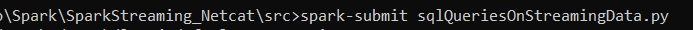
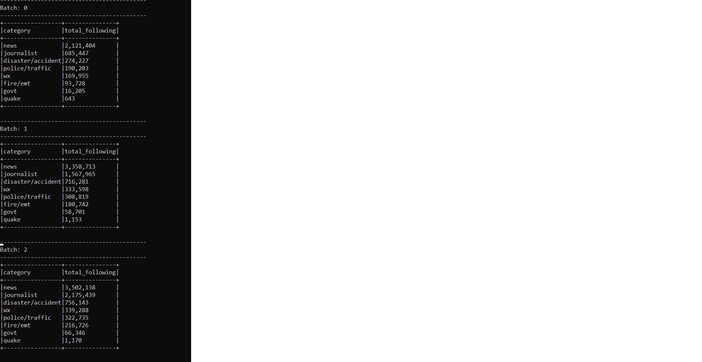

# SparkStreaming_Netcat

## Run project 
- Install ncat.
## Copy file to a specified streaming folder, the program will read streaming data in this file and write results to console
## Project will implement read streaming data and display result to console with options outputMode of writeStream function in PySpark

### Result streaming in console ncat

### Run file on cmd 

### Result streaming of sqlQeriesOnStreamingData.py

