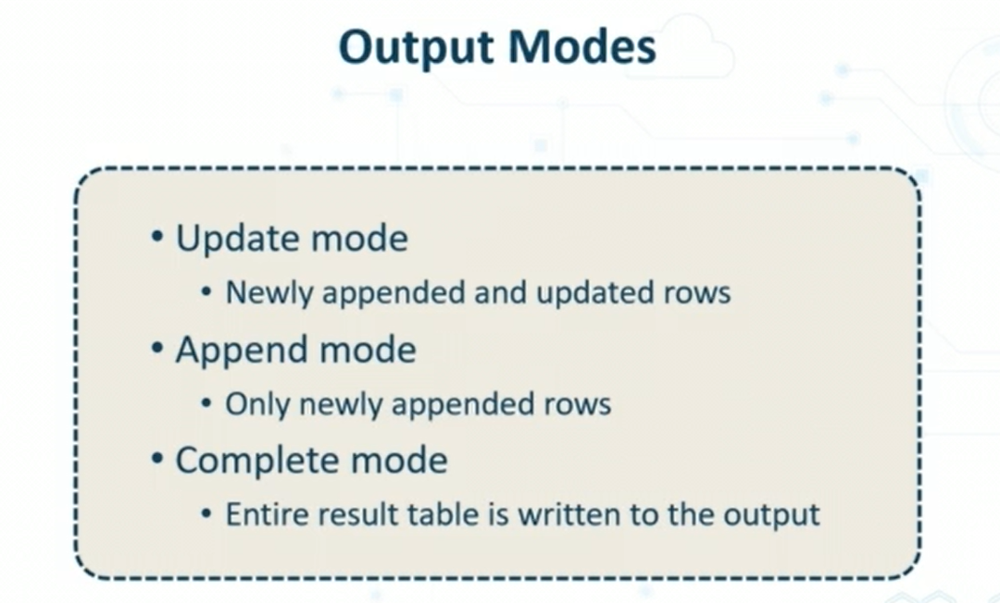
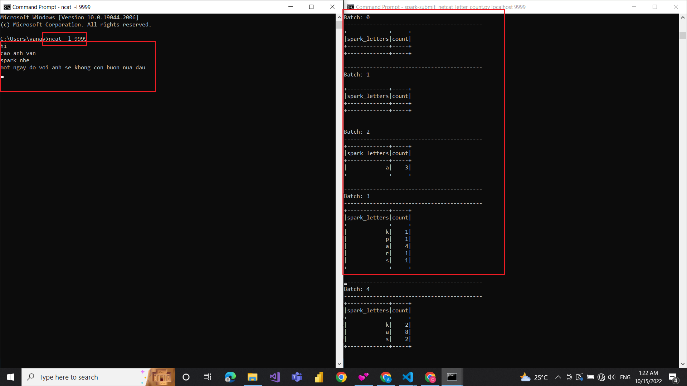

# SparkStreaming_Netcat

## Run project 
- Install ncat.
## Project will implement read streaming data and display result to console with options outputMode of writeStream function in PySpark

## Result streaming in console ncat
